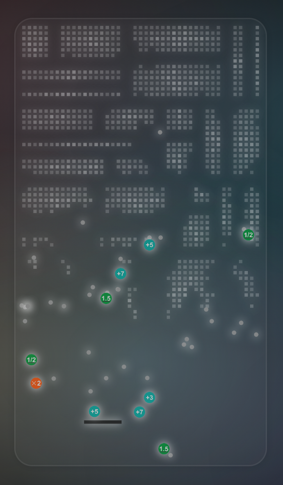

# BlockStorm

BlockStorm is a thrilling block-breaking game that brings a fresh twist to the classic genre. With its unique features and engaging game play, BlockStorm offers a one-of-a-kind gaming experience for players of all ages.

# Features
6 Exciting Items: BlockStorm introduces a variety of power-up items to enhance your game play.
Adjustable Player Size: Experiment with 2 different items that allow you to change the size of your player, adapting to the challenges ahead.
Ball Multipliers: Utilize 4 special items that increase the number of balls in play, adding an extra layer of strategy to your game.
Dynamic Ball Behavior: Watch out for the intriguing mechanic where the ball progressively weakens and ultimately collapses after a random number of hits.
Experience the thrill of BlockStorm and test your skills in this exciting twist on the classic block-breaking game. Are you ready to conquer the storm of blocks?


# DEMO



# Installation

```bash
npm i
```

# Usage

```bash
npm run dev
```

# Author
https://github.com/iizuka-0000

# License
Copyright (c) iizuka-0000. All rights reserved.

Licensed under the MIT license.
